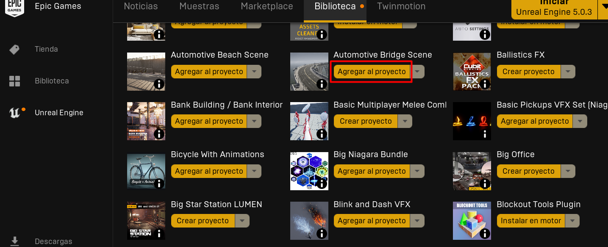
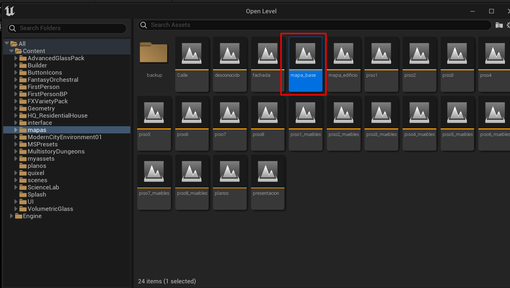
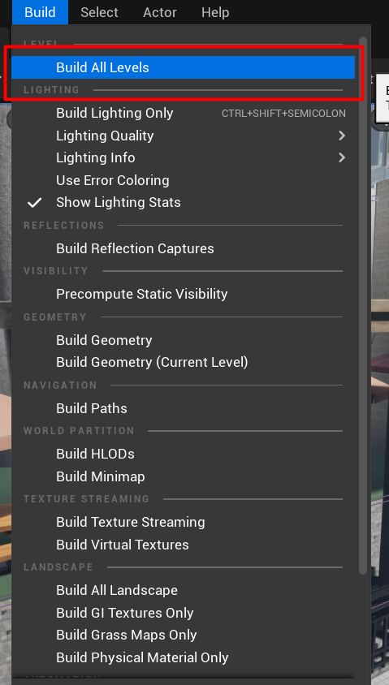

# Inmersión UD

Inmersión UD es un proyecto creado originalmente en Unreal Engine 4.25 y se ha migrado a Unreal Engine 5.0. Si desea instalar el proyecto, siga las instrucciones que aquí se muestran 


## Requisitos

- **Unreal Engine 5.0 o superior:** no se recomienda una versión menor, ya que puede causar incompatibilidades y se recomienda usar la versión 5.0, puesto que es la que está establecida en el proyecto. También puede usar una versión superior y para ello debe de realizar una migración a esa versión y para ello le ayudará el motor de desarrollo para que el proceso sea amigable. 

- **Instalar o descargar todos los assets:** El proyecto emplea un grupo de assets para la interfaz y una gran cantidad de modelos 3D del proyecto. Para ello siga las instrucciones de la sección instalación de assets. Los assets a instalar son:


Previo a cualquier instalación se assets debe de clonar el proyecto usando 

```
git pull https://github.com/BOTOOM/FacultadDeIngenieriaUE4.git 
```

Y ya dentro de proyecto, ábralo una única vez para que Unreal Engine lo reconozca y sin importar los errores, luego ciérrelo. Estos errores saldrán, ya que aún no tiene ningún asset instalado.

### Instalación de assets

Los assets se han conseguido para el proyecto por medio de promociones mensuales dadas por Epic Games, por lo cual si requiere los assets puede conseguirlos en la tienda de assets de Unreal Engine o puede conseguirlos free de alguna página que los provea, puesto que la mayoría de estos son de pago. Cabe aclarar que el paquete que sí es requerido obtener mediante la tienda es el paquete de auto settings, ya que ese paquete se instala sobre el motor y no sobre el proyecto.

Sí, obtiene los assets desde la tienda de assets de Unreal Engine para añadirlos al proyecto los podrá añadir con facilidad usando el launcher de Epic Games como se muestra en la siguiente imagen:




Si consigue los paquetes de assets de algún proveedor externo debe de añadir el contenido en la carpeta `content` en la cual se almacenan todos los assets y seguido de ello crear una carpeta con el nombre que requiere el asset en el cual irá todo el contenido de la biblioteca de asset. En la siguiente tabla se muestra el paquete de assets, su link en epicgames y el nombre del folder

| Nombre  | Enlace  | Folder  |
|---|---|---|
| Modern City Downtown  |  https://www.unrealengine.com/marketplace/en-US/product/modern-city-downtown-with-interiors-megapack |  Content/ModernCityEnvironment01/ |
| Multistory Dungeons | https://www.unrealengine.com/marketplace/en-US/product/top-down-multistory-dungeons  | Content/MultistoryDungeons/ |
| Volumetric Glass  | https://www.unrealengine.com/marketplace/en-US/product/volumetric-glass  | Content/VolumetricGlass/  |
| Advanced Glass Material Pack  | https://www.unrealengine.com/marketplace/en-US/product/advanced-glass-material-pack  |  Content/AdvancedGlassPack |
| HQ_ResidentialHouse  |  https://www.unrealengine.com/marketplace/en-US/product/hq-residential-house |  Content/HQ_ResidentialHouse |
| Sound Phenomenon Fantasy Orchestra  | https://www.unrealengine.com/marketplace/en-US/product/fantasy-orchestral-music  |  Content/FantasyOrchestral |
| Science Laboratory  |  https://www.unrealengine.com/marketplace/en-US/item/4e4e6995f839410cb282936c076c180d | Content/ScienceLab  |
| Elementos propios usando Quixel  | https://github.com/BOTOOM/FacultadDeIngenieriaUE4/releases/download/v1.0.0/quixel.rar  |  Content/quixel |
|  FX Variety Pack |  https://www.unrealengine.com/marketplace/en-US/product/a36bac8b05004e999dd4b1d332501f49 | Content/FXVarietyPack/  |
|  Auto Settings | https://www.unrealengine.com/marketplace/en-US/product/auto-settings-game-options-and-input-binding-toolkit  | Este  es un plugging que se instala en el motor de desarrollo  |


Luego de tener ya todos los assets instalados. Abra el proyecto. Por defecto se le abrirá el nivel llamado presentación. Posteriormente, abra el nivel llamado `mapa_base` en el cual se encuentra todo el edificio



Al estar en este nivel realicé el proceso de build de texturas y luces.



En este momento ya tendrá el proyecto listo para realizar diferentes modificaciones según se desee.
